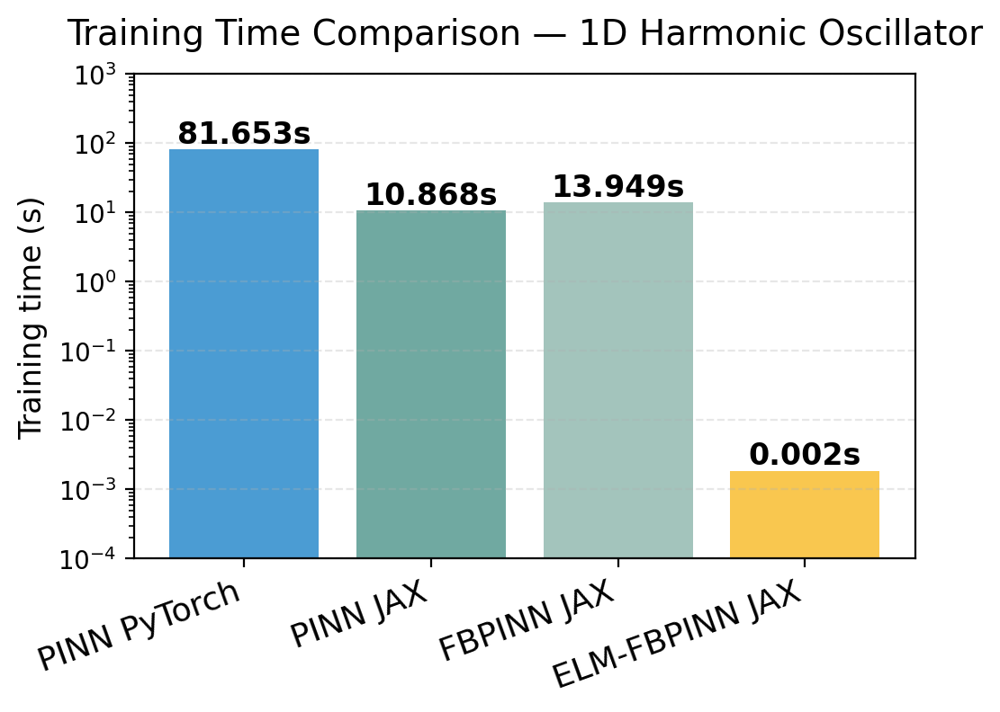
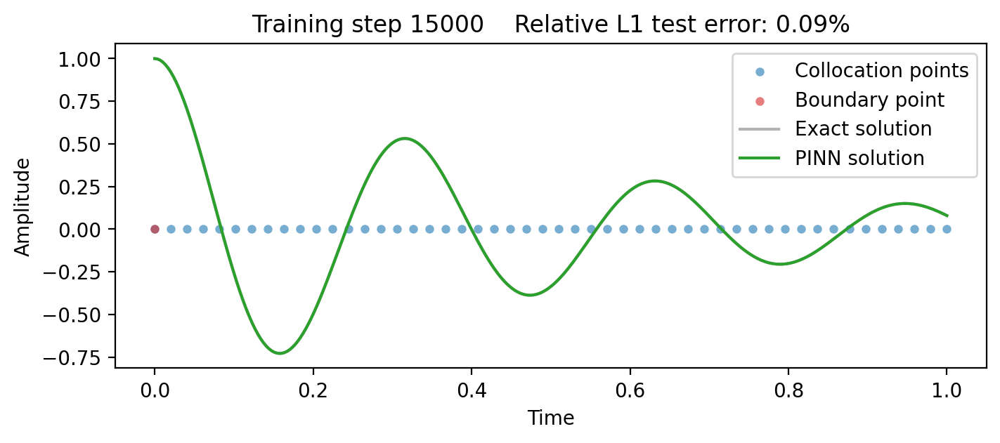

# Scalable physics-informed neural networks

Written by Ben Moseley, October 2025.

In this 1-day workshop our goal is to design **efficient** and **scalable** physics-informed neural networks (PINNs) for solving PDEs.

By the end of the workshop, you should:

- Understand why standard PINNs can be a slow and inaccurate method to solve PDEs
- Be able to code a PINN in JAX from scratch
- Be able to use domain decomposition to improve the efficiency and accuracy of PINNs, and
- further improve efficiency by using least-squares solvers to train the PINN
- Understand the basics of JAX and gain experience writing performant scientific machine learning code.

    

    

    

    Fig 1: Training times of the different models tested in this workshop (top) on the 1D harmonic oscillator problem (bottom)

# Structure

The workshop is split into three sessions:

- **Session 1**:
    - **Lecture (1 hr):** Introduction to SciML and PINNs
    - **Code-along (30 min):** Training a PINN in PyTorch  
    

- **Session 2**:
    - **Lecture (30 min):** Introduction to JAX
    - **Practical (1 hr):** Introduction to JAX and coding a PINN from scratch in JAX  
    

- **Session 3**:
    - **Lecture (30 min):** Challenges with PINNs and improving their performance with domain decomposition and numerical linear algebra
    - **Practical (1 hr):** Coding finite basis PINNs and extreme learning machine FBPINNs in JAX  
    

# Coding tasks

Each practical session involves you completing a notebook with missing code. Each task is labelled like this:

> Task: do this!

The notebooks are designed for you to go at your own pace, and also contain extension excercises to stretch those with previous experience.

If you get stuck, please ask the instructors for help, and the completed notebooks are available in this repository for your reference.

# References

This workshop primarily builds upon our papers on FBPINNs and ELM-FBPINNs:

> *[Finite Basis Physics-Informed Neural Networks (FBPINNs): a scalable domain decomposition approach for solving differential equations](https://link.springer.com/article/10.1007/s10444-023-10065-9), B. Moseley, T. Nissen-Meyer and A. Markham, Advances in Computational Mathematics, 2023.*

> *[Local Feature Filtering for Scalable and Well-Conditioned Domain-Decomposed Random Feature Methods](https://arxiv.org/abs/2506.17626), J. W. van Beek, V. Dolean & B. Moseley, arXiv/under review, 2025.*

> Check out our highly performant `fbpinns` [GitHub library](https://github.com/benmoseley/FBPINNs) if you want to build on FBPINNs further.

> Check out our ETH Zurich *AI in the Sciences and Engineering* [YouTube course](https://www.youtube.com/watch?v=LkKvhvsf6jY&list=PLJkYEExhe7rYFkBIB2U5pf_RWzYnFLj7r&index=1) if you want to learn more about scientific machine learning.

Here are two of the seminal papers introducing PINNs:

> *[Artificial neural networks for solving ordinary and partial differential equations](https://ieeexplore.ieee.org/document/712178), I. Lagaris, A. Likas, D. Fotiadis, IEEE Transactions on Neural Networks, 1998.*

> *[Physics-informed neural networks: A deep learning framework for solving forward and inverse problems involving nonlinear partial differential equations](https://www.sciencedirect.com/science/article/pii/S0021999118307125), M. Raissi, P. Perdikaris, G. E. Karniadakis, Journal of Computational Physics, 2019.*